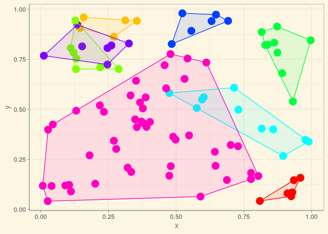
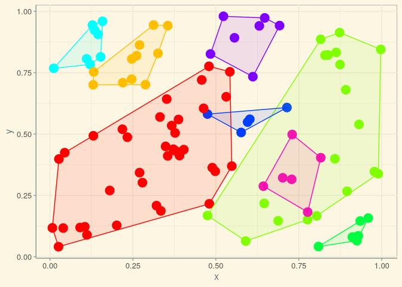

<!-- README.md is generated from README.Rmd. Please edit that file -->

```{r, echo = FALSE}
knitr::opts_chunk$set(
  collapse = TRUE,
  comment = "#>",
  fig.path = "README-"
)
```

[](https://github.com/mpadge/spatialcluster/actions?query=workflow%3AR-CMD-check)
[](http://www.repostatus.org/#wip)
[](https://codecov.io/gh/mpadge/spatialcluster)

# spatialcluster

An **R** package for spatially-constrained clustering using either distance or
covariance matrices. The package includes both an implementation of the
REDCAP collection of efficient yet approximate algorithms described in [D. Guo's
2008 paper, "Regionalization with dynamically constrained agglomerative
clustering and
partitioning."](https://www.tandfonline.com/doi/abs/10.1080/13658810701674970)
(pdf available
[here](https://pdfs.semanticscholar.org/ead1/7df8aaa1aed0e433b3ae1ec1ec5c7e785b2b.pdf)),
with extension to covariance matrices, and a new technique for computing
clusters using complete data sets. The package is also designed to analyse
matrices of spatial interactions (counts, densities) between sets of origin and
destination points. The spatial structure of interaction matrices is able to be
statistically analysed to yield both global statistics for the overall spatial
structure, and local statistics for individual clusters.
''Spatially-constrained'' means that the data from which clusters are to be
formed also map on to spatial reference points, and the constraint is that
clusters must be spatially contiguous.


## Installation

You can install `spatialcluster` using any of the following options:

```{r gh-installation, eval = FALSE}
# install.packages("remotes")
remotes::install_git("https://git.sr.ht/~mpadge/spatialcluster")
remotes::install_bitbucket("mpadge/spatialcluster")
remotes::install_gitlab("mpadge/spatialcluster")
remotes::install_github("mpadge/spatialcluster")
```

## Usage

There are two main functions, `scl_redcap()` and `scl_exact()`, where the latter
generates a clustering scheme using all available data. Both of these require
three main arguments:

1. A rectangular matrix of coordinates of points to be clustered (`n` rows; at
   least 2 columns);
2. An `n`-by-`n` square matrix quantifying relationships between those points;
3. A single value (`ncl`) specifying the desired number of clusters.

Usage can be demonstrated with some simple fake data:
```{r}
n <- 100
xy <- matrix (runif (2 * n), ncol = 2)
dmat <- matrix (runif (n ^ 2), ncol = n)
```
The load the package and call the function:
```{r load, echo = FALSE, message = FALSE}
library (spatialcluster)
```
```{r fake-run, eval = FALSE}
library (spatialcluster)
scl <- scl_redcap (xy, dmat, ncl = 8, linkage = "single")
plot (scl)
```

```{r plot-single, echo = FALSE, eval = FALSE}
scl <- scl_redcap (xy, dmat, ncl = 8, linkage = "single")
plot (scl)
```
<!--  -->


```{r plot-average, eval = FALSE}
scl <- scl_redcap (xy, dmat, ncl = 8, linkage = "average")
plot (scl)
```
<!--  -->


```{r plot-complete, eval = FALSE}
scl <- scl_redcap (xy, dmat, ncl = 8, linkage = "complete")
plot (scl)
```
<!--  -->


```{r plot-fullsingle, eval = FALSE}
scl <- scl_full (xy, dmat, ncl = 8, linkage = "single")
plot (scl)
```
<!--  -->


```{r plot-fullaverage, eval = FALSE}
scl <- scl_full (xy, dmat, ncl = 8, linkage = "average")
plot (scl)
```
<!--  -->


This example illustrates the universal danger in all clustering algorithms: they
can not fail to produce results, even when the data fed to them are definitely
devoid of any information as in this example. Clustering algorithms should only
be applied to reflect a very specific hypothesis for why data should be
clustered in the first place; spatial clustering algorithms should only be
applied to reflect two very specific hypothesis for (i) why data should be
clustered at all, and (ii) why those clusters should manifest a spatial
pattern.
