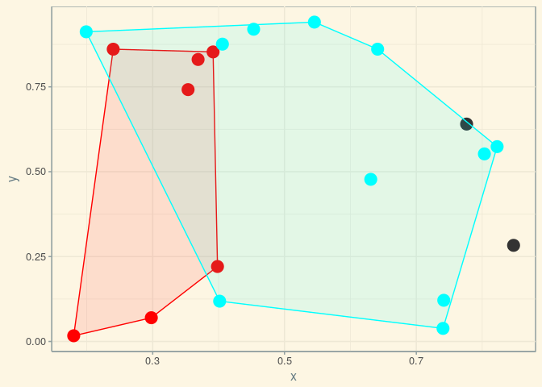

<!-- README.md is generated from README.Rmd. Please edit that file -->
[](https://travis-ci.org/mpadge/spatialcluster) [](http://www.repostatus.org/#concept) [](https://codecov.io/gh/mpadge/spatialcluster)

spatialcluster
==============

R port of redcap spatial clustering, as described in [D. Guo's 2008 paper, "Regionalization with dynamically constrained agglomerative clutering and partitioning."](https://www.tandfonline.com/doi/abs/10.1080/13658810701674970) (pdf available [here](https://pdfs.semanticscholar.org/ead1/7df8aaa1aed0e433b3ae1ec1ec5c7e785b2b.pdf)).

Installation
------------

You can install spatialcluster from github with:

``` r
# install.packages("devtools")
devtools::install_github("mpadge/spatialcluster")
```

Usage
-----

``` r
library (spatialcluster)
```

``` r
xy <- matrix (runif (100), ncol = 2)
edges <- scl_edges (xy)
# add some fake data to the edges
edges %<>% dplyr::mutate (d = runif (nrow (.))) %>%
   dplyr::arrange (desc (d))
edges
#> # A tibble: 274 x 3
#>     from    to     d
#>    <int> <int> <dbl>
#>  1    11    22 0.995
#>  2    13    20 0.992
#>  3     1    22 0.983
#>  4     6    10 0.973
#>  5     9    12 0.972
#>  6    11    30 0.965
#>  7    38    14 0.964
#>  8    49    50 0.960
#>  9    11     1 0.957
#> 10    37    28 0.951
#> # ... with 264 more rows
# get tree with component numbers
ncl <- 12 # desired number of clusters/components
tree <- scl_spantree (edges) %>%
    scl_cuttree (edges, ncl = ncl)
tree
#> # A tibble: 38 x 3
#>     from    to  comp
#>    <int> <int> <dbl>
#>  1    45    25    3.
#>  2     6    21    2.
#>  3    14    34    3.
#>  4    18    38    4.
#>  5    31     9    4.
#>  6    37    25    3.
#>  7    44    46    2.
#>  8    31    29    4.
#>  9    10    38    4.
#> 10    39    32    3.
#> # ... with 28 more rows
```

The clusters resulting from the cutting the spanning tree can then be viewed with:

``` r
g <- scl_plot (tree, xy)
```


